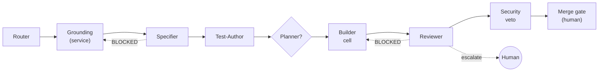

# SDD Agent Structure — discussion pack

One-page pre-read for the 2-hour session on defining our Spec-Driven Development (SDD)
agent structure. Full detail in the documents below.

- **[prep-brief.md](prep-brief.md)** — **read this first** — the ~1-hour facilitator's prep
  brief: the position, the vocabulary, objections + rebuttals, and your recommended answers.
  The single doc to run the whole discussion from.
- **[agent-architecture.md](agent-architecture.md)** — the deep proposal (roles, backbone,
  the capability ladder, substrate, phased adoption, reference mapping).
- **[agent-checklists.md](agent-checklists.md)** — per-agent, per-step operational checklist
  (what each agent/spine-component does, its skills, its exit verdict, its gate).
- **[discussion-agenda.md](discussion-agenda.md)** — facilitator's run-of-show + the 11
  decisions to close in the room.

## The thesis

> **The naive four (requirements, orchestrator, planner, code) conflated *roles* with
> *agents*.** The SDD lifecycle *sequence* is known in advance, so the "orchestrator"
> should be **deterministic code, not an LLM agent** — forever. Intelligence belongs
> *inside* stages, not in the conductor. The defensible structure is a **deterministic,
> cyclic spine** carrying a **traceability + assumption ledger**, with **four core agents
> earned by distinct reasoning modes and trust boundaries — Specifier, Test-Author,
> Builder, Reviewer** — plus **conditional Grounding and Planner** promoted only on a
> testable trigger. What makes it "spec-driven" is the **traceability spine**, not the
> agent count.

## Verdict on the starting assumption

| Assumed agent | Ruling | Becomes |
|---|---|---|
| **Requirements** | Keep as agent (absorb ADR) | **Specifier** |
| **Orchestrator** | **Cut** as a peer agent | the **deterministic spine** |
| **Planner** | Cut from base | a **Builder mode** (promote on a measurable trigger) |
| **Code** | Keep as agent | **Builder** (orchestrator-workers cell) |
| _(missing)_ | **Add** | **Grounding**, **Reviewer**, **Test-Author** |

## Topology at a glance

**Rule of thumb for the whole design:** *dynamic within a stage, deterministic between
stages.* The model decides each stage's verdict (`PASS` / `BLOCKED` / `ESCALATE`); the
code-owned spine decides what that verdict does.

## Capability ladder (not everything is an agent)

`tool → micro-skill → skill → subagent → agent` — increasing autonomy and cost. Reach for
the lowest rung that works: a **tool** is one capability; a **micro-skill** is one atomic,
testable step (where the spine's determinism lives); a **skill** is a packaged recurring
procedure that keeps agents consistent; a **subagent** is a delegated agent with its own
context (Builder workers, read-only Grounding); an **agent** owns a stage. *A new tool is
not a new skill; a new skill is not a new subagent.* (Decision **D11**.)

## What to decide in the room

Eleven decisions (see the agenda). The four that block a Phase-1 build: **the gateway
decision** (deterministic spine — §1), **Reviewer independence** (D3), **Grounding
contract-vs-cache** (D4), and **loop-budget numbers** (D5).
