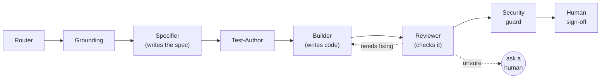

# SDD Agents — documentation

How AI can help build software **carefully and safely**: write down what we want first, build
it, then check the result — with AI workers doing the jobs and a human approving the key steps.

## 🟢 New here? Read these two first (plain English)

1. **[start-here.md](start-here.md)** — the whole idea in **one page**.
2. **[glossary.md](glossary.md)** — every term in **plain words**.

## 🗣️ Running the first meeting?

**[first-meeting.md](first-meeting.md)** — just **4 decisions** for the first meeting; everything
else is parked. Start there. (The full [discussion-agenda.md](discussion-agenda.md) is the
longer *backlog*, not a first-meeting to-do.)

## Then, if you want a bit more

- **[keeping-it-safe.md](keeping-it-safe.md)** — how **humans, guardrails, and an independent
  checker** keep it safe (the part that matters most).
- **[how-each-part-works.md](how-each-part-works.md)** — how each worker is built, and how the
  rules (only the Builder writes code, reviewer ≠ builder, an un-skippable security check) are
  actually enforced.
- **[example-endpoint-change.md](example-endpoint-change.md)** — a **worked example**: one real
  request (change or add an API endpoint) walked through every worker, showing exactly where
  **you** approve.
- **[harness-options.md](harness-options.md)** — which **real tool** runs and enforces it:
  **GitHub Copilot**, the **Copilot CLI**, or **GitLab** — with a recommendation and the
  smallest safe setup.
- **[harness-synergy.md](harness-synergy.md)** — how the tools **work together**: what role
  VS Code Copilot, the Copilot CLI, and GitLab (with or without Duo) each take, and how to mix them.
- **[install.md](install.md)** — a **simple setup checklist**.

## In one sentence

> A fixed, predictable software "**assembly line**" where **AI workers each do one job**, a
> **human approves the key moments**, and **safety guards + an independent checker** keep the
> work honest.

## Advanced / optional (deep reference for the design discussion)

You **don't** need these to understand or follow the discussion — they're the detailed,
expert-level design.

- [prep-brief.md](prep-brief.md) — facilitator's brief for the 2-hour session.
- [agent-architecture.md](agent-architecture.md) — the full proposal.
- [agent-checklists.md](agent-checklists.md) — per-agent, step-by-step detail.
- [discussion-agenda.md](discussion-agenda.md) — the decisions to make in the meeting.
