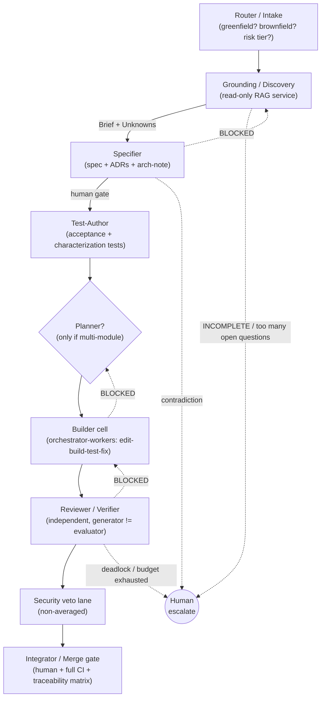

# SDD Agent Architecture — a generic reference design

> **Status:** Draft for the 2-hour discussion · **Date:** 2026-07-01 · **Scope:** Spec-Driven Development (SDD)
> **Audience:** the working session that will define our agent structure.
> **Nature:** vendor-neutral reference architecture — mappable to Claude/Copilot subagents, LangGraph, Copilot Studio, or a plain pipeline. Not tied to any code already in this repo.

This document challenges the starting assumption of four agents
(**requirements, orchestrator, planner, code**) and proposes a defensible structure
for an SDD system that must:

- work for **greenfield *and* brownfield** projects;
- **tolerate low code quality and low-quality / incomplete information** (ambiguous,
  contradictory, or missing specs);
- **generate code** (requirements → plan → code → verify).

It is grounded in seven industry references (see [References](#references)) and was
pressure-tested through an adversarial design pass — a draft critiqued from three
independent lenses (minimalism, coverage, control-flow) and reconciled.

---

## TL;DR — the one thing to say in the room

> **The naive four conflated *roles* with *agents*.** The SDD lifecycle *sequence* is
> known in advance, so the "orchestrator" should be **deterministic code, not an LLM
> agent** — forever. Intelligence belongs *inside* stages, not in the conductor. The
> defensible structure is a **deterministic, cyclic spine** carrying a **traceability +
> assumption ledger**, with **four core agents earned by distinct reasoning modes and
> trust boundaries — Specifier, Test-Author, Builder, Reviewer** — plus **conditional
> Grounding and Planner** promoted only on a testable trigger. What makes it
> "spec-driven" is the **traceability spine**, not the agent count.

### Verdict on the four assumed agents

| Assumed agent | Ruling | Becomes |
|---|---|---|
| **Requirements** | **Keep as agent** — absorb ADR into it | The **Specifier** (elicit + reconcile + author spec/ADRs). Spec-validation is a deterministic lint, not a role. |
| **Orchestrator** | **Cut as a peer agent** | The **deterministic spine** (the pipeline itself). An LLM conductor would add cost/latency/nondeterminism to a known sequence and break auditability. |
| **Planner** | **Cut from the base** | A **mode of the Builder** until multi-module parallelism is real; promoted to a standalone agent on a measurable trigger. |
| **Code** | **Keep as agent** (the one unambiguous agent) | The **Builder** — an *orchestrator-workers* cell (edit→build→test→fix), not a single worker. |

**And the four are incomplete.** The constraints make three omitted responsibilities
first-class: **Grounding/Discovery** (brownfield is impossible without it), independent
**Review/Verification** (low code quality ships without it), and acceptance-**Test
authoring** (nobody else turns "done criteria" into executable checks — and letting the
Builder do it re-collapses generator and evaluator).

---

## 1. Orchestration backbone — deterministic cyclic spine, dynamic pockets

**Decision: a deterministic workflow backbone (a prompt-chain of stages) with bounded,
LLM-directed sub-loops *inside* named stages, and deterministic *back-edges* between
stages fired by model-emitted verdicts.** Explicitly **not** the OpenAI Manager pattern
(an LLM calling agents-as-tools reintroduces the nondeterministic conductor) and **not**
decentralized handoffs (peer-to-peer control destroys the single owner of "what stage
are we in").

- **Deterministic *between* stages** — the sequence (ground → spec/ADR → tests → plan →
  code → review → gate) is knowable and must be auditable (Anthropic *workflows vs
  agents*; Microsoft *deterministic-vs-dynamic gateway*).
- **Dynamic *within* stages** — how to explore an unknown codebase, reconcile a
  contradiction, or fix a failing test is open-ended (the augmented-LLM building block:
  retrieval + tools + memory in a Thought→Action→Observation loop).
- **Rule of thumb for the debate:** *dynamic within a stage, deterministic between
  stages.*

**SDD is a graph with cycles, and the cycles are owned by code.** Each stage's exit
contract emits one typed verdict; the **model decides the verdict**, the **spine decides
what the verdict does**:

- `PASS` → advance (forward edge)
- `BLOCKED(reason, target_stage)` → deterministic **back-edge** to a *named* earlier
  stage (e.g. `Review→Builder`, `Builder→Planner`, `Spec→Grounding`)
- `ESCALATE(reason)` → human gate

**Mandatory guardrail:** every back-edge carries a **loop budget** (per-edge max
iterations + a global step/cost cap). Exhaustion trips `ESCALATE` — never a silent
give-up or an infinite spin. Generator↔evaluator deadlock (Builder↔Reviewer can't
converge) is a *named terminal state*.

**Forbidden to any LLM:** stage sequencing, gate/quality *decisions*, traceability
bookkeeping, budget enforcement. Those are code — that is what makes the process
governable.

---

## 2. Core role set

A thing is an **agent** only if it has a **distinct reasoning mode, an error-reducing
specialization, real parallelism, or a genuine trust boundary**. "Different tool, same
reasoning" → it is a tool or a step, not an agent.

| Role | Responsibility | Type (IBM/RH) | Pattern (Anthropic/OpenAI) | Tools (generic) | I/O contract | Human gate |
|---|---|---|---|---|---|---|
| **Specifier** | Elicit intent, reconcile ambiguity/contradiction, produce a **testable Spec + ADRs + arch-note**; record open questions & assumptions | Goal-based | Prompt-chaining + evaluator-optimizer; input guardrail + HITL | RAG over specs/tickets/prior ADRs; contradiction-checker; templates; option-scoring rubric (**read-only**) | Intent + Grounding Brief → {Spec, ADRs, arch-note} with IDs + assumptions | **Yes — spec/decision gate (mandatory)** |
| **Test-Author** | Turn acceptance criteria into **executable acceptance tests**, independent of the Builder; author characterization tests to pin current behaviour on brownfield | Goal-based | Generator≠evaluator applied to tests | Test framework; RAG over Spec/ADR; coverage mapper (**read code, write tests only**) | Approved Spec → acceptance-test suite, each test citing a requirement ID | Gated at merge |
| **Builder** (worker cell) | Implement each task until acceptance criteria pass; may write unit scaffolding; emit an uncertainty note | Goal-based worker; the *set* is multi-agent | Orchestrator-workers + evaluator-optimizer | Editor/patch, build, test runner, linter, code-search (**read + write**) | Task → diff + passing task tests + "what I did / unsure about" note, tagged task+requirement IDs | Batch-gated at merge |
| **Reviewer / Verifier** | Independently verify the diff against Spec/ADR/acceptance tests and quality bars; check code honours recorded assumptions; find author-blind defects | Utility-based critic | Evaluator-optimizer (generator≠evaluator) + output guardrail | Test runner, coverage, static analysis, **traceability checker**, diff+intent reader (**different context from Builder**) | Diff + Spec + tests → Verification Report → `PASS`/`BLOCKED`/`ESCALATE` | Feeds the merge gate |

### Deterministic spine components (NOT agents)

| Component | Responsibility |
|---|---|
| **Router / Intake** | Classify greenfield vs brownfield, risk-tier the change, pick the pipeline profile and which gates are live (routing pattern). *This is the "orchestrator" the naive set imagined — a router, not an LLM peer.* |
| **Spec Validator** | Lint: every requirement has an acceptance criterion + an ID |
| **Escalation policy** | Own the STOP/ask decision: blocking open-question halts advancement; assumption budget; contradiction ⇒ human, gap ⇒ budgeted assumption |
| **ID / Trace authority** | Mint & carry `requirement → decision → task → code → test` IDs; validate links **at each exit contract** |
| **Security veto lane** | SAST, secret-scan, dependency/SCA, ingestion sanitization — a **non-averaged veto**, not a score term |
| **Integrator / Merge gate** | Full CI, assert requirement-coverage completeness, present traceability matrix for human sign-off |
| **Loop-budget enforcer** | Per-edge + global step/cost caps; trips `ESCALATE` on exhaustion |

### Conditional roles (promote only on a testable trigger)

| Role | Promote when | Otherwise it is… |
|---|---|---|
| **Grounding/Discovery** (agent-form) | Router flags large/low-quality brownfield **and** the RAG-tool form leaves the Specifier under-grounded | a read-only RAG tool + retrieval/memory **service** the Specifier calls |
| **Planner** (standalone agent) | A change spans ≥2 modules with real inter-task dependencies **and** parallel fan-out genuinely fires | a planning **step** inside the Builder cell |
| **Design/ADR** (re-split from Specifier) | ADRs need a *different approver* than the spec, or an adversarial decision-reviewer is wanted (a **new trust boundary** appears) | a Specifier sub-responsibility emitting a distinct artifact |

### The capability ladder: tools → micro-skills → skills → subagents → agents

Not every capability is an "agent." The same *burden-of-proof-escalates* rule that governs
agent count governs everything below it. Five layers, in increasing order of autonomy and
cost:

| Layer | What it is | Reasons? | Own context? | Reach for it when | SDD examples |
|---|---|---|---|---|---|
| **Tool** | one external capability (function/API) | no | no | an agent needs to *act* on the world | `run_tests`, `code_search`, `apply_patch`, RAG query |
| **Micro-skill** | one atomic, single-purpose step with a tight contract (deterministic-leaning) | no | no | a *single step* recurs across agents and benefits from isolation + unit tests | "req has criterion+ID", "mint trace-ID", "normalize table header", "dedupe findings" |
| **Skill (broad)** | a packaged multi-step *procedure* = instructions + tools + templates, loaded on demand | shapes an agent; doesn't reason alone | no (runs in the agent's context) | a repeated *how-to* recurs and must stay consistent + versioned | "author-ADR", "author-acceptance-tests", "characterize-legacy-behavior" |
| **Subagent** | a separate agent instance delegated a bounded task, own prompt/context/tool-scope | **yes** (own TAO loop) | **yes** | you need isolated/large context, a different trust boundary, or parallel fan-out | a Builder *worker*; a read-only Grounding researcher; an adversarial reviewer |
| **Agent** | a stage owner with a reasoning loop + a verdict contract | yes | yes | a stage needs open-ended judgment + a trust boundary | Specifier, Test-Author, Builder, Reviewer |

**The climb rule (same spirit as "start single-agent"):** reach for a **tool** first;
extract a **micro-skill** when one step is reused and you want it testable/deterministic;
package a **skill** when a whole procedure recurs and must stay consistent; promote to a
**subagent** only when you need *isolated context, a different trust boundary, or
parallelism* — the same bar as adding an agent. **A new tool is not a new skill; a new
skill is not a new subagent.**

**Why this layer matters in SDD specifically:**
- **Micro-skills are where the spine's determinism lives** — Spec Validator, the ID/Trace
  authority, header-normalization, the escalation-policy check are micro-skills: pure,
  unit-testable, reused by every agent. This is how the deterministic guarantees get
  *shared* without copy-pasting prompt text.
- **Skills keep agents consistent and lean** — every agent loads the same
  `traceability-link` and `assumption-ledger-append` skills, so behavior is uniform and
  the prompt stays short (Copilot Studio: *description quality drives correct selection*).
- **Subagents are how the Builder cell and Grounding scale** — orchestrator-workers
  fan-out *is* "spawn N Builder subagents"; Grounding-as-agent is a subagent the Specifier
  calls; an adversarial reviewer can be a subagent of the Reviewer.

**Broad-skill vs micro-skill is the same tension one level down:** broad skills are fewer
and easier to author but monolithic and hard to reuse partially; micro-skills are
composable, testable, and reusable but add registry/orchestration overhead and demand
high-quality descriptions. Decide granularity deliberately (decision **D11** in the
agenda).

---

## 3. Shared substrate (the platform every role plugs into)

1. **Artifact Store = single source of truth = memory.** Versioned store of every
   artifact; **all inter-role communication is via artifacts, not chat** (this is what
   makes it deterministic, auditable, resumable). **Versioned with supersession** — a new
   Spec marks priors superseded and flags downstream artifacts **stale** via trace links
   (a targeted re-run trigger, not silent rot). Distinguishes **facts** (grounded) /
   **decisions** (human-gated) / **derivations** (agent output).
2. **Assumption Ledger (pipeline-long).** What makes "tolerate low-quality info" real: any
   stage appends `Assumption`/`OpenQuestion`; the Reviewer checks code against open
   assumptions; the merge gate surfaces unresolved ones.
3. **Grounding as a re-queryable service, not a one-shot stage.** The Brief is a **cache,
   not a frozen contract**; later stages write back late-discovered facts and re-query.
   Has an explicit **coverage contract**, a **budget**, and a `Grounding: INCOMPLETE`
   hard-gate failure mode.
4. **Knowledge / semantic index** — RAG over spec + code + docs + prior ADRs.
5. **Tool catalog** with per-tool **scope (read-only vs write)** and high-quality
   descriptions (Copilot Studio: description quality drives selection). Write tools go
   only to Builder + Integrator.
6. **Guardrails / Responsible-AI** — layered: input validation (Specifier), output
   validation (Reviewer), **ingestion sanitization** (treat retrieved repo/docs as data,
   not instructions — a real brownfield prompt-injection surface), secret redaction, human
   gates.
7. **Traceability spine** — `requirement → decision → task → code → test`, validated
   incrementally; the matrix is *asserted* (not built from scratch) at merge. **This, not
   the agent count, is what makes the process spec-driven.**
8. **Monitoring / channels** — per-stage logs, retries, budgets, gate outcomes; human
   surfaces (IDE/PR/chat) kept out of the core.

---

## 4. Brownfield + low-quality handling (the sharp-edge scope)

Center of gravity **shifts left**: on brownfield, Grounding and spec-reconciliation do
most of the work; coding is easy once the map and spec are solid. A design that starts at
"requirements → code" fails precisely because it skips grounding.

| Messy-input problem | Owner | Mechanism |
|---|---|---|
| Comprehend existing code | Grounding service | Read-only ReAct/RAG loop with a **coverage checklist** + **budget**; exits `COMPLETE` or fails loud with `INCOMPLETE` + holes. Claims tagged observed/inferred/assumed. |
| Ambiguous / contradictory / missing specs | Specifier + Escalation policy | Typed `OpenQuestion(severity)`; **contradiction ⇒ always human-escalated**; **gap ⇒ budgeted assumption**; a blocking question **halts advancement** in the spine. |
| No tests / unknown current behaviour | Test-Author | Acceptance tests from the Spec, independent of Builder; **characterization tests** pin current behaviour first. |
| Low code quality ships | Reviewer + Security veto | Generator≠evaluator; static analysis + coverage + **non-averaged security veto**; Reviewer checks code vs assumption ledger. |
| "Done" ≠ tests-green | Reviewer + merge gate | Requirement-coverage (deterministic) **and** done-criteria conformance (critic checks diff vs acceptance-criteria *text*). |

**Escalation is deterministic, not discretionary:** insufficient-grounding gate (fail
early before spending spec/code effort) → spec/decision gate → conditional plan gate →
merge + security veto (never auto-waivable) → budget-exhaustion/deadlock. **"Infeasible as
specified" is a valid terminal state** — the system must be able to say *this can't be
done*.

---

## 5. Phased adoption path (start simple; add on a trigger)

Grounded in OpenAI's *start single-agent, add only when justified* and Anthropic's
*simplest thing that works*. Promote a step to an agent only when a **testable** trigger
fires.

- **Phase 0 — Single augmented LLM + human.** One agent (RAG + test runner), human reviews
  everything. Proves the loop end-to-end. → *grow when* one context can't hold
  discovery + spec + code + review reliably.
- **Phase 1 — MVP: deterministic spine + THREE agents** (Specifier, Builder, Reviewer),
  generator≠evaluator from day one — the reviewer the naive four omit is in the MVP, not
  bolted on later. ADR/Plan start as templates; grounding is the RAG-tool form. → *add
  Test-Author when* the Builder is certifying its own code or acceptance criteria ship
  uncovered.
- **Phase 2 — Add Test-Author** (independent acceptance + characterization tests). In a
  test-poor brownfield shop this moves *into* Phase 1. → *add Planner when* a change spans
  ≥2 modules with real dependencies **and** single-shot implementation stalls/loses
  coherence.
- **Phase 3 — Add explicit Planner + orchestrator-workers fan-out** (+ a conflict-reconciler
  for parallel workers touching overlapping code). → *add Grounding-as-agent when* Router
  flags large/low-quality brownfield and the tool form under-grounds the Specifier.
- **Phase 4 — Grounding as a first-class service + hardening** (assumption ledger goes
  pipeline-long, security veto lane, back-edges + budgets fully wired, artifact
  supersession on). **There is no Phase-5 LLM orchestrator** — the cyclic state machine
  already covers "the sequence became unpredictable," and is strictly more auditable.

---

## 6. Reference mapping (defend every choice)

| Design choice | Backed by |
|---|---|
| Deterministic spine, LLM only *inside* stages | Anthropic *workflows vs agents*; Microsoft *deterministic-vs-dynamic gateway* |
| Backbone is prompt-chaining, not Manager, not handoffs | Anthropic *prompt chaining*; OpenAI *Manager vs handoffs* (rejected at top level for traceability) |
| Start single-agent; burden-of-proof on *adding* an agent | OpenAI *Practical Guide*; Anthropic *simplest that works* |
| A new tool ≠ a new agent (agent = model + tools + instructions) | OpenAI *Practical Guide* |
| Every stage is a Thought→Action→Observation loop | Hugging Face *TAO / ReAct* |
| Grounding/Specifier/Reviewer as augmented LLMs (retrieval + tools + memory) | Anthropic *augmented LLM* |
| Builder = orchestrator-workers; Builder↔Reviewer & Spec/ADR = evaluator-optimizer | Anthropic *orchestrator-workers*, *evaluator-optimizer* |
| Router = routing; wide grounding scans = parallelization | Anthropic *routing*, *parallelization* |
| Specifier goal-based; ADR/Reviewer utility-based; Planner goal/hierarchical; worker set multi-agent | IBM / Red Hat *taxonomy* |
| Layered guardrails + ingestion sanitization | OpenAI *guardrails*; Microsoft *Responsible-AI* |
| Tool catalog with scoped, well-described capabilities | Copilot Studio; Microsoft *tools/catalog* |
| Artifact store / knowledge index / memory / monitoring as substrate | Microsoft *components of agent architecture* |

---

## 7. Open questions (full agenda in [discussion-agenda.md](discussion-agenda.md))

The session must leave the room with answers to eleven decisions — Specifier/ADR split,
the metric that promotes Planner, Reviewer independence, Grounding-as-contract-vs-cache,
concrete loop budgets, where test-authoring lives, risk-tiered human gates,
any-residual-LLM-orchestrator, artifact-store versioning, security-veto-vs-score, and the
**skill / micro-skill / subagent granularity** (see the capability ladder in §2).
Each is written up with options, trade-off, and a recommendation in the agenda.

---

## Bottom line

The naive four conflated roles with agents. The defensible answer is a **deterministic,
cyclic spine** carrying a **traceability + assumption ledger**, with **four core agents
earned by distinct reasoning modes and trust boundaries — Specifier, Test-Author, Builder,
Reviewer** — plus **conditional Grounding and Planner** promoted on testable triggers. The
orchestrator is code, forever. What makes it spec-driven is the traceability spine, not the
agent count.

---

## References

1. IBM — *AI agent types* — <https://www.ibm.com/think/topics/ai-agent-types>
2. Red Hat — *Understanding AI agent types: simple & complex* — <https://www.redhat.com/en/blog/understanding-ai-agent-types-simple-complex>
3. Hugging Face — *Agent steps and structure* (Thought→Action→Observation) — <https://huggingface.co/learn/agents-course/en/unit1/agent-steps-and-structure>
4. OpenAI — *A practical guide to building agents* — <https://cdn.openai.com/business-guides-and-resources/a-practical-guide-to-building-agents.pdf>
5. Anthropic — *Building effective agents* — <https://www.anthropic.com/engineering/building-effective-agents>
6. Microsoft — *Components of agent architecture* — <https://learn.microsoft.com/en-us/agents/architecture/components-of-agent-architecture>
7. Copilot Studio — *Building agents in Copilot Studio* — <https://medium.com/@khushboo.nijhawan/building-agents-in-copilot-studio-heres-the-guide-i-wish-existed-when-i-started-f31c33bc640a>
