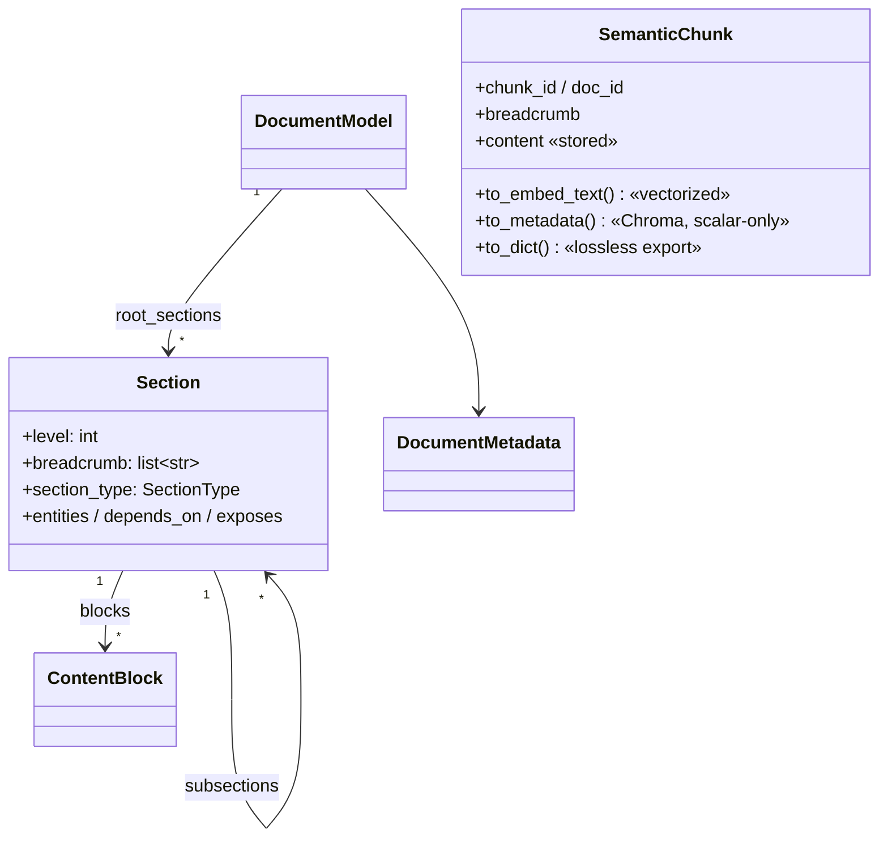

# Tour 01 — models.py & config.py: the contract layer

**Role in the pipeline.** [models.py](../../../src/sdd_pipeline/models.py) is the
equivalent of a `Domain.Contracts` class-library project in a C# solution: pure
dataclasses every stage passes around, with no service logic and no external
dependencies. [config.py](../../../src/sdd_pipeline/config.py) is the typed
settings object (think `IOptions<PipelineConfig>` bound from environment
variables) that every knob in the system flows through.

## Reading order

1. **`models.py::ContentType` and `models.py::SectionType`** — both are
   `StrEnum` (an enum whose members *are* strings — C# has no direct analog;
   closest is an enum plus `[EnumMember(Value=...)]` serialization). *Why does
   `SectionType` carry `ALTERNATIVE`/`TRADEOFF`/`CONSEQUENCE`/`DONE_CRITERIA`
   in addition to the obvious doc types?* (Hint: the comment above them; see
   also [CLAUDE.md](../../../CLAUDE.md) "Key design points".)
2. **`models.py::ContentBlock`** — one typed block (paragraph/code/table/...).
   *Why does only code populate `language`?*
3. **`models.py::Section`** — note `subsections: list[Section]`: the type
   refers to itself (legal because of `from __future__ import annotations`,
   like a C# class with a `List<Section> Children` property). Also note the
   four enrichment outputs (`section_type`, `entities`, `depends_on`,
   `exposes`) default to empty — *who fills them in, and when?* (Answer:
   [tour 03](03-enrichment.md).)
4. **`models.py::DocumentModel`** — the whole parsed page. Read
   `iter_sections`: *is the flattening depth-first or breadth-first, and does
   the order matter to any caller?*
5. **`models.py::SemanticChunk`** — the unit that gets embedded and indexed.
   This is where the system's key idea lives; read it slowly.

## The one distinction that explains the whole system

A `SemanticChunk` has **two textual identities**:

- `content` — what is stored, displayed, exported (`to_dict`) and filtered on
  (`to_metadata`).
- `to_embed_text()` — what is actually **vectorized**.

Open `models.py::SemanticChunk.to_embed_text` and trace one chunk through it:

```python
crumb = " > ".join(self.breadcrumb)
...
if keywords:
    parts.append("keywords: " + ", ".join(keywords))
...
header = " | ".join(parts)
body = (
    _summarize_table_for_embed(self.content)
    if self.content_type == ContentType.TABLE
    else self.content
)
return f"{header}\n\n{body}" if header else body
```

Guiding questions while tracing: which four kinds of token does the method
deliberately *drop* from the header (the docstring lists them)? Why does
`models.py::_summarize_table_for_embed` keep only the header row of a table
plus `(table, N data rows)`? Note `_EMBED_LANGS` (module constant, ~line 16,
just above `_summarize_table_for_embed`) — the allowlist that decides whether
a `lang:` tag is trusted enough to embed.



`SemanticChunk` stands apart from the tree: [chunking.py](../../../src/sdd_pipeline/chunking.py)
flattens Sections into chunks, copying breadcrumb + enrichment fields onto each.

## config.py: how a knob travels

Pick `max_chunk_chars` and follow it end to end:

1. Declared in `config.py::PipelineConfig` as `Field(default=2000, ...)` —
   overridable via `PIPELINE_MAX_CHUNK_CHARS` (env prefix in `model_config`).
2. Consumed in `pipeline.py::SemanticPipeline.enrich_and_chunk`, which passes
   `self.config.max_chunk_chars` into `chunking.py::chunk_document`.
3. Inside `chunking.py::_section_to_chunks` it becomes the split width — but
   note it can be *narrowed* by `embed_char_budget - _header_reserve(section)`
   so the rendered embed text fits the model's token cap.

Now scroll to the bottom of config.py: the **same class is defined twice**
(`try: pydantic_settings ... except ImportError:` v1 fallback). Every new
field must be added to both branches — the trap and its history are covered in
[bridge 06](../bridge/06-pydantic-settings-and-typer.md), don't learn it twice.

## Executable documentation

- [tests/test_models.py](../../../tests/test_models.py) —
  `test_embed_text_summarizes_table` (the table-summary rule, end to end) and
  `test_to_metadata_lists_json_encoded` (why lists become JSON strings:
  Chroma metadata must be scalar).
- [tests/test_config.py](../../../tests/test_config.py) —
  `test_env_json_array_parsed` (how `PIPELINE_ENTITY_TERMS='["KPO","XCom"]'`
  becomes a `list[str]`) and `test_embed_char_budget_override`.

## Self-check

1. In the pydantic-settings branch `entity_terms` is declared with
   `Field(default_factory=list)`, but the v1 fallback writes
   `entity_terms: list[str] = []`. Why is the bare `= []` safe here, when the
   same line in a plain `@dataclass` would be rejected?
   <details><summary>Answer</summary>
   Pydantic models copy (deep-copy) field defaults per instance, so each
   <code>PipelineConfig()</code> gets its own list. A plain dataclass would
   raise <code>ValueError: mutable default ... is not allowed</code> at class
   definition time, because the single list object would be shared by every
   instance — the same bug as a C# <code>static</code> field initializer used
   where you meant a per-instance initializer. That's why
   <code>Section.blocks</code> in models.py uses
   <code>field(default_factory=list)</code>.
   </details>
2. A chunk has `section_type=SectionType.CONTENT` and an empty breadcrumb.
   What does `to_embed_text()` return?
   <details><summary>Answer</summary>
   Just the body: the <code>[content]</code> prefix is omitted (null type
   carries no signal), the crumb part is skipped when empty, and if no
   keywords/tags survive, <code>header</code> is empty so the method returns
   <code>body</code> alone.
   </details>
3. Why are there three serializations (`to_embed_text`, `to_metadata`,
   `to_dict`) instead of one?
   <details><summary>Answer</summary>
   Three different consumers: the embedding model (lossy, signal-dense
   header + summarized tables), ChromaDB metadata (scalar-only, lists
   JSON-encoded — see <code>to_metadata</code>'s type signature), and the
   export artifact (lossless arrays + the exact <code>embed_text</code> for
   downstream pipelines).
   </details>
