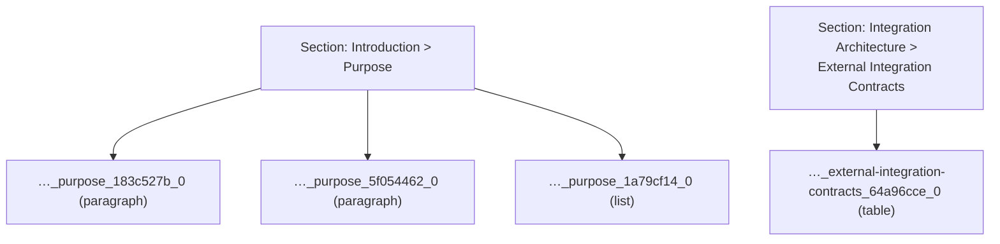

# Life of a document — `sad-retailnexus-oms.md`, end to end

> One real file, every stage, real artifacts. Keep the [architecture map](02-architecture-map.md)
> open in a second tab; this page walks one document along its arrows. Commands and
> conventions live in [CLAUDE.md](../../../CLAUDE.md) and [README.md](../../../README.md).

```mermaid
flowchart LR
    MD[".md file"] -->|"ast_parser.py"| AST["pandoc JSON AST"]
    AST -->|"structural.py"| TREE["DocumentModel<br/>section tree"]
    TREE -->|"extract_structural.py<br/>extract_prose.py (stage 3.5)"| INV["entity inventory"]
    TREE -->|"enrichment.py"| ENR["enriched sections"]
    INV -->|"enrichment.py"| ENR
    ENR -->|"chunking.py"| CHUNKS["SemanticChunk[]"]
    CHUNKS -->|"embeddings.py"| VEC["vectors"]
    VEC -->|"vector_store.py"| IDX["index"]
    IDX -->|"retrieval.py"| HITS["search results"]
```



## Setup: dump the intermediate artifacts

`src/sdd_pipeline/dump.py` runs the model-free stages only (pandoc → structural →
enrich → chunk) and writes one JSON file per stage:

```powershell
.\.venv\Scripts\python.exe src\sdd_pipeline\dump.py src\tools\eval\corpus\sad-retailnexus-oms.md build\dump\retailnexus
```

Real output:

```text
src\sdd_pipeline\dump.py:9: SyntaxWarning: invalid escape sequence '\.'
  .\.venv\Scripts\python.exe dump.py path\to\your-file.md [out-dir]
Wrote build\dump\retailnexus\ast.json, build\dump\retailnexus\enriched.json, build\dump\retailnexus\chunks.json (47 chunks).
```

> **Gotcha aside — that SyntaxWarning is real.** The module docstring of
> `dump.py::main`'s file contains the Windows path `.\.venv\Scripts\python.exe`, and in a
> normal Python string literal `\.` is an unrecognized escape sequence — Python warns today
> and will make it an error in a future release. The fix is a raw string (`r"""..."""`),
> Python's equivalent of C#'s verbatim `@"..\path"`. Same disease, different cure: C# makes
> `"\."` a hard compile error (CS1009); Python lets it slide with a warning.

Read `src/sdd_pipeline/dump.py` (67 lines) before going on — every claim below about
*which* call produced *which* file comes from it.

## Stage 2 — markdown → pandoc AST (`ast_parser.py::generate_ast`)

Our tracer bullet is the **External Integration Contracts** section. The source
(`src/tools/eval/corpus/sad-retailnexus-oms.md`):

```markdown
# Integration Architecture

## External Integration Contracts

| System | Protocol | Direction | Trigger | SLA |
|----|----|----|----|----|
| Stripe / Adyen (Payment) | REST / Webhooks | OMS → Provider, Provider → OMS | Checkout, Refund | p99 < 2s |
| SAP WM (Inventory) | REST (OData v4) | Bidirectional | Reservation, Release | p95 < 500ms |
| FedEx / DHL / UPS | REST | OMS → Carrier | Shipment Create, Cancel | p95 < 1s |
...
```

In `build/dump/retailnexus/ast.json` pandoc has shredded that heading into typed nodes — note
the auto-generated slug `external-integration-contracts`, which you will meet again in
every later artifact:

```json
{
  "t": "Header",
  "c": [
    2,
    ["external-integration-contracts", [], []],
    [
      {"t": "Str", "c": "External"},
      {"t": "Space"},
      {"t": "Str", "c": "Integration"},
      {"t": "Space"},
      {"t": "Str", "c": "Contracts"}
    ]
  ]
},
{
  "t": "Table",
  "c": [["", [], []], [null, []], [[{"t": "AlignDefault"}, {"t": "ColWidthDefault"}], ...], ...]
}
```

**Guiding question:** the AST is a *flat* list of blocks — the `Header` and the `Table`
are siblings. So who decides the table *belongs to* the section? That's stage 3.

## Stages 3–4 — AST → section tree (`structural.py::build_structural_model`)

In `build/dump/retailnexus/enriched.json`, find `"section_id": "external-integration-contracts"`.
The flat blocks are now a tree — the section is nested under `Integration Architecture`
(that's where `breadcrumb` comes from) and *owns* its blocks:

```json
{
  "level": 2,
  "title": "External Integration Contracts",
  "section_id": "external-integration-contracts",
  "breadcrumb": ["Integration Architecture", "External Integration Contracts"],
  "blocks": [
    {
      "block_id": "64a96cce",
      "content_type": "table",
      "text": "| System | Protocol | Direction | Trigger | SLA |\n| --- | --- | --- | --- | --- |\n| Stripe / Adyen (Payment) | REST / Webhooks | OMS → Provider, Provider → OMS | Checkout, Refund | p99 < 2s |\n...",
      "language": null,
      "raw": null
    }
  ],
  "subsections": [],
  "section_type": "api",
  "entities": ["Kafka", "REST"],
  ...
}
```

**Where did the table go?** It wasn't lost or flattened to prose — it was re-serialized
as canonical pipe-table markdown inside `blocks[0].text`. Structure-preserving
serialization is the whole point of stage 3; how each pandoc node type is handled is
[tour 02](../tours/02-ast-parser-and-structural.md).

## Stage 3.5 + 5 — inventory + enrichment (the artifact discrepancy)

The excerpt above already shows stage 5's work: `"section_type": "api"` (rule-based, see
`enrichment.py::enrich_section` and [tour 03](../tours/03-enrichment.md)) and
`"entities": ["Kafka", "REST"]`. But look closer at `enriched.json` — the same section has:

```json
  "depends_on": [],
  "exposes": [],
  "metadata": {}
```

Empty. Now find the *same* section's chunk in `build/dump/retailnexus/chunks.json`:

```json
{
  "chunk_id": "56bf98e5a179_external-integration-contracts_64a96cce_0",
  "breadcrumb": ["Integration Architecture", "External Integration Contracts"],
  "section_type": "api",
  "entities": ["Kafka", "REST"],
  "depends_on": [
    "Bidirectional",
    "OMS → Carrier",
    "OMS → ERP",
    "OMS → Provider",
    "OMS → Provider, Provider → OMS"
  ],
  "exposes": [],
  "metadata": {
    "raw_entities": ["and-forget", "AWS", "DHL", "ERP", "FedEx", ...],
    "sla": ["Async < 5min", "Fire-and-forget", "p95 < 1s", "p95 < 500ms", "p99 < 2s"],
    "trigger": ["Checkout, Refund", "Invoice trigger on ship", ...],
    "system": ["FedEx / DHL / UPS", "SAP S/4HANA (ERP)", "SAP WM (Inventory)", ...],
    "protocol": ["IDOC / RFC over MQ", "REST", "REST (OData v4)", ...]
  },
  ...
}
```

Populated. **Why does `chunks.json` know the dependencies but `enriched.json` doesn't?**
Read `dump.py::main`: it makes **two different calls**. `enriched.json` comes from a
direct `enrichment.py::enrich_document` call — *no* `inventory` argument, so the
table-column-to-field routing never runs. `chunks.json` comes from
`pipeline.py::SemanticPipeline.enrich_and_chunk`, which first builds the stage-3.5
inventory (`pipeline.py::SemanticPipeline._build_inventory`, merging
`extract_structural.py::build_structural_inventory` + `extract_prose.py::build_prose_inventory`)
and passes it in. The `Direction` column routes to `depends_on`; non-directional columns
(`SLA`, `Protocol`, …) land in `metadata` — see [tour 06](../tours/06-inventory-extraction-modules.md).

There's a Python lesson hiding here too: `enrich_document`'s docstring says
*"the mutation is in-place for performance; the same object is returned"*. `dump.py`
enriches `doc`, then `enrich_and_chunk` re-enriches **the same object** — dataclasses are
reference types (like C# classes, not structs/records), so the second pass mutates what
the first pass already touched. It works here only because enrichment is idempotent-ish;
it's still a sharp edge worth noticing.

## Stage 6 — chunks: `content` vs `embed_text` (the money shot)

The same chunk carries two texts. **`content`** is what's *stored* and shown to a human:

```text
| System | Protocol | Direction | Trigger | SLA |
| --- | --- | --- | --- | --- |
| Stripe / Adyen (Payment) | REST / Webhooks | OMS → Provider, Provider → OMS | Checkout, Refund | p99 < 2s |
| SAP WM (Inventory) | REST (OData v4) | Bidirectional | Reservation, Release | p95 < 500ms |
...
```

**`embed_text`** (rendered by `models.py::SemanticChunk.to_embed_text`) is what's
*vectorized* — context prepended, enrichment folded in, the table body **summarized** so
high-entropy cells don't dominate the vector:

```text
[api] Integration Architecture > External Integration Contracts | keywords: Kafka, REST, Async < 5min, Fire-and-forget, p95 < 1s, p95 < 500ms, p99 < 2s, Checkout, Refund, ... | depends on: Bidirectional, OMS → Carrier, OMS → ERP, OMS → Provider, OMS → Provider, Provider → OMS

| System | Protocol | Direction | Trigger | SLA |
| --- | --- | --- | --- | --- |
(table, 5 data rows)
```

Everything an answer needs survives in `content`; everything a *query* might say is
front-loaded into `embed_text`. [Tour 07](../tours/07-chunking.md) covers the splitting
and the embed budget.

How sections fan out (this section yields one chunk; prose sections fan wider — dump
runs with prose-merging off):



## Stage 7 — index and search

```powershell
sdd-pipeline index .\src\tools\eval\corpus -o .\build\learn-index --model all-MiniLM-L6-v2
# Done. 162 chunks indexed from 5 files (0 errors).
```

(Memory backend by default — peek at `build\learn-index\sdd_docs.json`: it's just the
chunks + vectors as JSON, plus `sdd_docs.provenance.json` recording provider/model/dimension.)

Dense search vs hybrid (`-H`), same query:

```powershell
sdd-pipeline search "what does the order management system depend on" -i .\build\learn-index --model all-MiniLM-L6-v2 -k 3
```

| Rank | Dense (cosine)                                              | Hybrid `-H` (RRF)                              |
|------|-------------------------------------------------------------|------------------------------------------------|
| 1    | **0.508** Introduction > Purpose (overview)                 | **0.033** Introduction > Purpose (overview)    |
| 2    | **0.425** ADR-003 — Choreography-Based Saga… (decision)     | **0.031** System Overview > Business Context   |
| 3    | **0.405** ADR-002 — CQRS… (decision)                        | **0.030** System Overview > Business Context   |

Two things to explain honestly:

- **Why did "Introduction > Purpose" win?** Look at its `embed_text` in `chunks.json`:
  `[overview] Introduction > Purpose\n\nThis Software Architecture Document (SAD)
  describes the technical architecture of the RetailNexus Order Management System (OMS),
  a cloud-native microservices platform…`. It contains the query's exact noun phrase
  *"Order Management System"* in a short, focused paragraph — but it does **not** contain
  "depend" in any form. The embedding rewarded topic/name overlap, not the relational
  intent. The chunk that actually *answers* the question (External Integration Contracts)
  never says "order management system" literally (only "OMS") and its embed text is a
  keyword-dense table summary — so it didn't crack the top 3. Enrichment narrows this
  gap; it doesn't erase it.
- **Why are hybrid scores ~0.03 instead of ~0.5?** Different scale, not worse results.
  `vector_store.py::SearchResult.score` returns `fused_score` when set, else
  `1 − distance` (cosine). Hybrid fuses dense + BM25 rankings with Reciprocal Rank
  Fusion: each scorer contributes `1/(rrf_k + rank)` with `rrf_k = 60`, so a chunk ranked
  #1 by *both* scorers gets ≈ 2/61 ≈ **0.033** — exactly Purpose's score (the literal
  phrase match makes BM25 love it too). See [tour 09](../tours/09-retrieval-and-hybrid-search.md).

## The contrast case, and your turn

Run the same dump on `src/tools/eval/corpus/impala-vscode.md` (→ `build/dump/impala/`): **13 chunks, zero
`depends_on`, zero `exposes`**. Two verifiable reasons: the doc contains no pipe tables
at all (nothing for `extract_structural.py::build_structural_inventory` to harvest;
prose records carry no column name and route to `metadata.raw_entities`), and
`doc_router.py::detect_doc_type` classifies it `"unknown"` — its headings don't match the
SAD fingerprint, so `doc_router.py::taxonomy_for` hands back an empty taxonomy
(heading-only enrichment). Details in [tour 05](../tours/05-taxonomy-modules.md) and
[tour 06](../tours/06-inventory-extraction-modules.md).

**Closing exercise pattern — change something upstream, predict the diff downstream.**
Rename the `Direction` column, demote the `##` heading to `###`, or add a row — *write
down* what you expect to change in `ast.json` → `enriched.json` → `chunks.json` →
the search ranking, then re-run `dump.py` and diff. Exercises 01, 02 and 05 in
[`learn/exercises/`](../exercises/) are built on exactly this loop.
