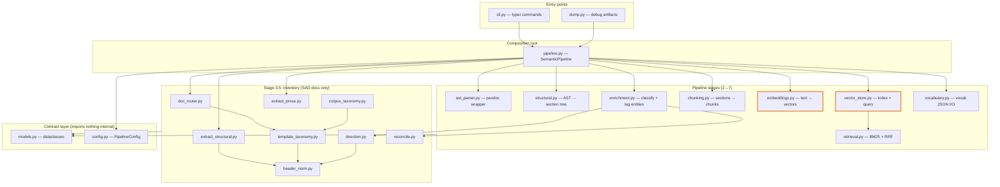
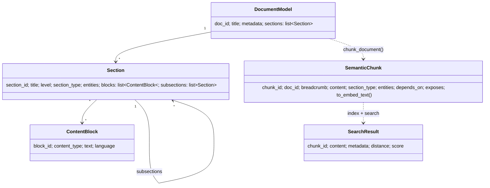

# Architecture map — the whole system on one page

> **Read this first.** Everything else in `learn/` hangs off this map.
> Companion docs: [CLAUDE.md](../../../CLAUDE.md) (guardrails), [ADR-0001](../../../docs/adr/adr-0001-modular-semantic-pipeline.md) (why it's modular).

## The one-sentence version

Markdown documents go in; a searchable vector index comes out; every arrow in between is one small module you can read in a sitting.

## Module dependency graph

The two orange boxes are the **Protocol seams** — the only places where heavyweight external services (an ML model, a vector database) plug in. Everything else is deterministic, dependency-free Python you can unit-test instantly.

## The layering rule (≈ onion architecture)

| Layer | Files | May import |
|---|---|---|
| Contracts | `models.py`, `config.py` | nothing internal |
| Stages | one file per stage | `models.py` only (plus each other's *data*, never each other) |
| Composition root | `pipeline.py` | everything |
| Entry points | `cli.py`, `dump.py` | `pipeline.py` (not stages directly) |

This is enforced socially, not technically — there's no compiler stopping a stage from importing another stage. The guardrails section of [CLAUDE.md](../../../CLAUDE.md) is the contract. **Self-check #1:** open `chunking.py` and confirm its imports obey the rule. 

Answer
Top of `chunking.py`: it imports `re` (stdlib) and `from .models import ...` — no other project module. The `entity_fn` callback parameter is how enrichment logic reaches chunking *without* an import: the function is injected by `pipeline.py::enrich_and_chunk`.

## Data model — what flows through the arrows

Three shapes matter: a **tree** (`DocumentModel` → recursive `Section`s), then a **flat list** (`SemanticChunk`s — the tree is flattened, each chunk remembering its path as `breadcrumb`), then **ranked hits** (`SearchResult`). Every stage transforms one shape into the next. All five are plain dataclasses in `models.py` — start there (tour 01).

## The two flows, and what's deferred

- **Flow A (this curriculum):** `.md` → AST → structure → enrich → chunk → embed → store → search. Orchestrated by `pipeline.py::SemanticPipeline`.
- **Flow B (Phase 2, deferred):** the `sdd_pipeline/convert/` subpackage — a standalone Confluence-HTML→Markdown converter (`base` shared layer + `html_to_gitlab_md` HTML path + `confluence_pf_filter` Stage-C filter). Zero imports from flow A. Read it only after you're fluent in flow A.
- **Developer tools** (not commands): `dump.py` writes the intermediate JSON of stages 2–6 for one file — your microscope for the whole curriculum. `scripts/eval_retrieval.py` measures search quality against `eval/queries.yaml`.

## Suggested code-reading order (complexity-ranked)

1. **Warm-up (trivial):** `vocabulary.py` (29 lines) → `reconcile.py` → `direction.py` → `header_norm.py` → `doc_router.py`
2. **Foundations:** `models.py` → `config.py` → `ast_parser.py`
3. **Pure logic:** `retrieval.py` → `extract_structural.py` → `extract_prose.py` → `template_taxonomy.py` → `corpus_taxonomy.py`
4. **The meat:** `structural.py` → `chunking.py` → `embeddings.py` → `vector_store.py` → `pipeline.py`
5. **The gnarly:** `enrichment.py` (regex-heavy) → `cli.py` (623 lines of typer)

**Self-check #2:** without looking, which module is the *only* one allowed to invoke pandoc, and which is the only one allowed to touch a vector database? 

Answer
`ast_parser.py` (pandoc, within flow A) and `vector_store.py` (both vector-store backends). These are two of the guardrails in CLAUDE.md — they exist so a dependency swap (new parser, new DB) touches exactly one file, which is also how the memory/Chroma backend split was done.

**Self-check #3:** `pipeline.py` constructs the embedder and the store *lazily* (see `pipeline.py::SemanticPipeline.embedder` and `.store` properties). What concrete benefit does that buy the test suite? 

Answer
Tests construct `SemanticPipeline(embedding_model=mock, vector_store=mock)` and the lazy properties never run — so no 80 MB+ model download and no database I/O in unit tests. It's `Lazy<T>` + constructor injection without a DI container. See `tests/test_pipeline.py::_make_pipeline`.

