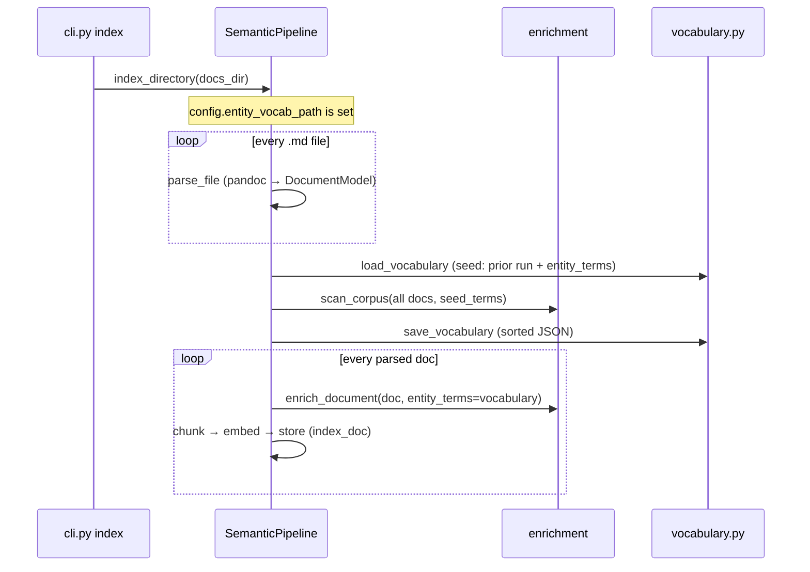

# Tour 04 — vocabulary.py & the two-pass corpus scan

**Role in the pipeline.** Per-file enrichment has a blind spot: a term coined
in document A (`settlement-engine`, `CQRS`) is invisible while enriching
document B, because `extract_entities` only knows the terms it is handed
([tour 03](03-enrichment.md)). The fix is a **cross-corpus vocabulary**:
scan every document first, collect candidate terms, then enrich every document
with the full list.

## Reading order

1. **[vocabulary.py](../../src/sdd_pipeline/vocabulary.py)** — read all 38
   lines. Two functions: `vocabulary.py::load_vocabulary` (missing file →
   `[]`, safe for first runs) and `vocabulary.py::save_vocabulary` (sorted,
   deduped, human-readable JSON). The module docstring carries the design
   intent: the file is **project knowledge, commit it** — and it exists at all
   because enrichment.py is declared pure (no I/O), so the I/O lives here.
   C# analogy: a tiny repository class kept out of the domain layer.
2. **`enrichment.py::scan_corpus`** — the discovery half. Read its docstring
   ("Why two passes?") first, then the mechanics: `seed_terms` (previous
   vocabulary + configured terms) merged with what
   `enrichment.py::_collect_raw_terms` finds — the three precision patterns
   *plus* the recall-only `_ALLCAPS_PATTERN` and `_BACKTICK_PATTERN`, filtered
   by `_ALLCAPS_STOPLIST` and `min_length` (default 3). *Guiding question:*
   `_collect_section_terms` is documented as "read-only" — why does that
   matter for when it may run?
3. **`pipeline.py::SemanticPipeline.scan_and_persist`** — pass 1, model-free:
   parse every path (`parse_file` is stages 2–4 only, deliberately *before*
   enrichment), seed with `config.entity_terms + load_vocabulary(...)`, run
   `scan_corpus`, `save_vocabulary`. Returns
   `(vocabulary, parsed_ok, failed_paths)` — note the parsed `DocumentModel`s
   are returned so pass 2 doesn't parse twice.
4. **`pipeline.py::SemanticPipeline._index_with_corpus_scan`** — pass 2:
   `index_doc(doc, vocabulary)` for every parsed doc. The gate is in
   `pipeline.py::SemanticPipeline.index_directory`:
   `if self.config.entity_vocab_path: return self._index_with_corpus_scan(paths)`
   — empty path means plain per-file indexing with static
   `config.entity_terms`.

## CLI surface

Verified in [cli.py](../../src/sdd_pipeline/cli.py):

- `cli.py::scan` — `sdd-pipeline scan <dir> --vocab PATH` runs *only* pass 1
  via `scan_and_persist` (no embedding model is ever constructed). The
  `--vocab` flag overrides the env var by building
  `PipelineConfig(entity_vocab_path=str(vocab))`; without it, the command
  errors unless `PIPELINE_ENTITY_VOCAB_PATH` is set. Use it to review/edit the
  term list before an index run.
- `cli.py::index` — has **no** `--vocab` flag; it picks the path up purely
  from config (`PIPELINE_ENTITY_VOCAB_PATH` env or `.env`) and prints
  "Corpus scan enabled → ..." when active. Same for `export` (still
  model-free). [docs/entity-vocab.json](../../docs/entity-vocab.json) is the
  committed seed example; see [CLAUDE.md](../../CLAUDE.md) Configuration.

## Executable documentation

- [tests/test_vocabulary.py](../../tests/test_vocabulary.py) —
  `test_round_trip_sorted_and_deduped` and
  `test_load_missing_path_returns_empty`.
- [tests/test_pipeline.py](../../tests/test_pipeline.py) — the scan flow has
  end-to-end coverage with a mocked embedder:
  `test_term_from_doc_a_tags_doc_b` (the whole point of the feature, in one
  test), `test_persists_and_accumulates_vocabulary` (run twice, vocabulary
  grows), and `test_seeds_from_entity_terms_and_prior_file` (the seeding rule
  of `scan_and_persist`).

## Self-check

1. Where can a term in the final vocabulary have come from? List all three
   sources.
   

Answer

   (a) <code>config.entity_terms</code> (env <code>PIPELINE_ENTITY_TERMS</code>),
   (b) the previously persisted vocabulary file via
   <code>load_vocabulary</code> — both passed as <code>seed_terms</code> —
   and (c) fresh discovery by <code>_collect_raw_terms</code> over the current
   corpus. <code>scan_corpus</code> merges all three, dedupes, sorts, and
   <code>min_length</code>-filters.
   

2. `scan_corpus` is called with documents that are *not yet enriched*. Could
   it be called after enrichment instead?
   

Answer

   It would still run (the walk reads <code>title</code> and block text,
   touching no enrichment fields — <code>_collect_section_terms</code> is
   read-only by design), but it would defeat the purpose: pass 2's
   <code>enrich_document</code> needs the vocabulary as input, so discovery
   must complete first. That ordering is why <code>parse_file</code> stops at
   stage 4.
   

3. A pandoc failure on one file during `scan_and_persist` — does it abort the
   run?
   

Answer

   No. The parse loop catches per-file exceptions into <code>failed</code>;
   the scan proceeds with the docs that parsed, and
   <code>_index_with_corpus_scan</code> reports the failures as
   <code>-1</code> in its results dict (same convention as plain
   <code>index_directory</code>).
   

