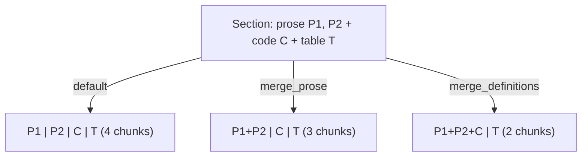

# Tour 07 — Chunking: sections → embeddable units

**Module:** [chunking.py](../../src/sdd_pipeline/chunking.py)

## Role in the pipeline

Stage 6 flattens the enriched section tree into `SemanticChunk`s — the units
that get embedded and indexed. Every chunk inherits its section's breadcrumb,
type, tags, and routed fields, so a retrieved chunk is self-describing.
Pure and deterministic: no I/O, fully unit-testable.

## Reading order

1. Start at the bottom: the `chunking.py::chunk_document` signature.

   ```python
   def chunk_document(
       doc: DocumentModel,
       max_chunk_chars: int = 2000,
       merge_prose: bool = False,
       entity_fn: Callable[[str], list[str]] | None = None,
       merge_definitions: bool = False,
       embed_char_budget: int | None = None,
   ) -> list[SemanticChunk]:
   ```

   `entity_fn` is a `Callable` parameter — dependency injection via a function,
   ≈ accepting a `Func<string, List<string>>` instead of an `IEntityExtractor`
   interface. `pipeline.py::SemanticPipeline.enrich_and_chunk` injects
   `lambda t: extract_entities(t, entity_terms)`, so `chunking.py` never imports
   `enrichment.py`. *Who decides the vocabulary — chunking or the caller?*
2. Read `chunking.py::_section_to_chunks` — the per-section walk. Note the inner
   `emit()` closure (builds chunks, recomputes entities) and the `packable` set
   choosing the merge strategy, then the recursion into `section.subsections`.
3. Back up to `chunking.py::_split_text` — the cascade: blank-line paragraphs →
   sentence-ending punctuation → hard cut at `max_chars`. *Why a cascade instead
   of one fixed-width cut?* Because a split mid-sentence destroys meaning; the
   hard cut is only the last resort for pathological unbroken text
   (`test_single_very_long_word_hard_cut`).
4. `chunking.py::_has_signal` — drops any text with no alphanumerics, e.g. the
   stray `\` a `<br/>` conversion leaves behind. Checked both per-block and
   per-split-piece.
5. `chunking.py::_header_reserve` — estimates the embed header's length (section
   type + breadcrumb + tags + `_ENTITY_RESERVE` ≈ 200 chars for keywords, ~line 24)
   so content can be split with room left for the header.

## The three merge strategies

In `_section_to_chunks`, precedence is explicit — `merge_definitions` is checked
**first**, so it overrides `merge_prose` (also stated in the `chunk_merge_definitions`
field description in [config.py](../../src/sdd_pipeline/config.py)):

```python
if merge_definitions:
    packable = _PROSE_TYPES | {ContentType.CODE}
elif merge_prose:
    packable = _PROSE_TYPES
else:
    packable = frozenset()
```



Tables are never packed: a non-packable block calls `flush()`, so it also
*breaks* a prose run (`test_code_breaks_the_prose_run`).

## Two budgets, two purposes

- `max_chunk_chars` (default 2000) caps the **stored** `content`.
- `embed_char_budget` (default 1800) caps the rendered **embed text**
  (header + content). The [config.py](../../src/sdd_pipeline/config.py) field
  description: *"Conservative for a 512-token model so vectors are not silently
  truncated."* In `_section_to_chunks`:

  ```python
  width = max(256, min(max_chunk_chars, embed_char_budget - _header_reserve(section)))
  ```

  Without this, header + content could exceed the model cap and the tail of the
  chunk would simply never reach the vector.

## Entity scoping

`emit()` calls `entity_fn(sub_text)` per chunk, so each chunk's `entities` come
from **its own content**. Without it, every chunk copies the section-level union —
a term mentioned once in one paragraph would "bleed" onto sibling chunks that
never reference it, making them false positives for keyword-flavoured queries.
See the design note in [CLAUDE.md](../../CLAUDE.md) (*Entity scoping*).

## Executable documentation

- `tests/test_chunking.py::TestEntityFnScoping::test_entity_fn_scopes_to_chunk_content`
  — "alpha here" gets only `["alpha"]`, no `beta` bleed.
- `tests/test_chunking.py::TestMergeDefinitions::test_table_stays_separate`
  — prose+code share a chunk; the table does not join it.
- `tests/test_chunking.py::TestEmbedBudget::test_embed_text_stays_within_budget`
  — every `to_embed_text()` ≤ the budget, proving `_header_reserve` works.

## Self-check

1. With `merge_prose=True` and `merge_definitions=True`, where does a code block
   end up?
   <details><summary>Answer</summary>Packed into the prose run:
   <code>merge_definitions</code> is checked first and sets
   <code>packable = _PROSE_TYPES | {ContentType.CODE}</code>, so the
   <code>merge_prose</code> branch is never reached — definitions mode overrides.</details>

2. A section header is huge (deep breadcrumb, many tags). Can `width` go to zero?
   <details><summary>Answer</summary>No — <code>width = max(256, ...)</code>
   floors the split width at 256 chars. The trade-off: an extreme header could
   then make embed_text exceed the budget slightly, but content is never split
   into uselessly tiny pieces.</details>

3. Why is each chunk's id `f"{doc_id}_{section.section_id}_{first_block_id}_{idx}"`
   rather than a GUID?
   <details><summary>Answer</summary>Determinism: re-indexing the same file
   produces the same ids, so the vector store's <code>upsert</code> replaces
   stale chunks instead of accumulating duplicates (see
   <code>test_upsert_replaces_same_chunk_id</code> in
   <a href="08-embeddings-and-vector-store.md">tour 08</a>).</details>
