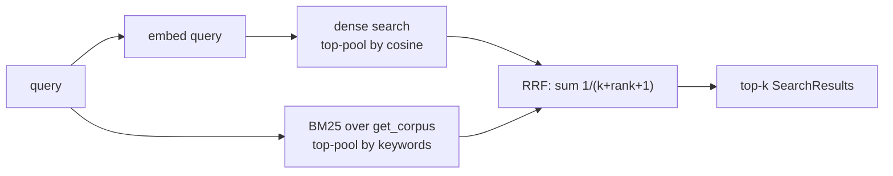

# Tour 09 — Hybrid retrieval: BM25 + Reciprocal Rank Fusion

**Modules:** [retrieval.py](../../src/sdd_pipeline/retrieval.py),
`pipeline.py::SemanticPipeline._hybrid_search` in
[pipeline.py](../../src/sdd_pipeline/pipeline.py)

## Role in the pipeline

Dense vectors find paraphrases but can rank a topically-near passage above the
one that literally contains the query terms; BM25 does the opposite (exact
keywords, no paraphrase). Hybrid search runs both and fuses the two rankings,
so "install vscode" surfaces the passage that *says* "Install VSCode", not just
one about editors.

## Reading order: retrieval.py (under 100 lines, read top to bottom)

1. `retrieval.py::tokenize` — lowercase alphanumeric runs; identifiers like
   `coordinator-0` survive as `["coordinator", "0"]`.
2. `retrieval.py::BM25Index` — minimal Okapi BM25, rebuilt per query (the
   docstring: corpora are small, rebuild cost negligible). The two constants:
   - `k1 = 1.5` — term-frequency saturation: how quickly repeated occurrences of
     a term stop adding score.
   - `b = 0.75` — length normalisation: how strongly long documents are
     penalised relative to `avgdl`.

   Note the idf formula in `__init__`:

   ```python
   self.idf = {
       term: math.log(1 + (self.n - freq + 0.5) / (freq + 0.5)) for term, freq in df.items()
   }
   ```

   *Guiding question: classic Okapi idf goes negative for a term in more than
   half the corpus — what does the `log(1 + …)` form (the "BM25+ style idf
   floor" comment) guarantee instead?* Also note `BM25Index.top` drops
   zero-score docs — no keyword overlap means no lexical vote at all.
3. `retrieval.py::reciprocal_rank_fusion` — each list contributes
   `1.0 / (k + rank + 1)` per id (rank 0-based), summed across lists. `rrf_k=60`
   is the classic constant: **higher k = flatter weighting** — the gap between
   rank 0 (`1/61`) and rank 5 (`1/66`) shrinks, so a single scorer's top hit
   matters less and consensus across scorers matters more.

## Reading order: pipeline.py::_hybrid_search, step by step

1. **Over-fetch the dense pool** — `store.search(..., n_results=pool)` with
   `pool = self.config.hybrid_candidate_pool` (default 50), so fusion has depth
   to promote items from below the final top-k.
2. **Fetch the lexical corpus** — `store.get_corpus(...)` with the *same*
   filters, then build `BM25Index` over
   `f"{c.metadata.get('breadcrumb', '')} {c.content}"` — the breadcrumb is folded
   in so section titles count as keywords.
3. **Fuse** — `reciprocal_rank_fusion([[dense ids], lexical_ids], k=self.config.rrf_k)`.
4. **Map back** — `by_id` is built from corpus results then updated with dense
   ones (dense carries real distances); each fused id becomes a
   `SearchResult(..., base.distance, fused_score)`.



## Fused scores are not similarities

A hybrid hit ranked first by both scorers gets `1/61 + 1/61 ≈ 0.033` — so the
same top chunk that shows `Score 0.508` in a dense search shows `0.033` in
hybrid. That is not a regression: `vector_store.py::SearchResult.score` returns
`fused_score` when set, and RRF scores are sums of reciprocal *ranks*, on a
completely different scale from cosine similarity. Compare orderings between
modes, never magnitudes.

## Config knobs

All `PIPELINE_`-prefixed env vars via [config.py](../../src/sdd_pipeline/config.py):
`hybrid_search` (default off; CLI `--hybrid`/`-H` per query),
`hybrid_candidate_pool` (50), `rrf_k` (60). Filters
(`--section-type`/`--space`) apply to **both** rankings — dense `search` and
`get_corpus` receive the same arguments.

## Executable documentation

- `tests/test_retrieval.py::TestBM25Index::test_phrase_match_ranks_first` and
  `TestReciprocalRankFusion::test_lexical_can_promote_over_dense_only`,
  `test_k_controls_weighting`.
- `tests/test_pipeline.py::TestSearch::test_hybrid_fuses_lexical_signal` — dense
  ranks the meta-sentence first; BM25 lifts the chunk literally containing
  "install vscode".
- Measurement harness: [scripts/eval_retrieval.py](../../scripts/eval_retrieval.py)
  scores a frozen golden set (recall@k, MRR) against a fresh index — see
  [eval/README.md](../../eval/README.md).

## Self-check

1. A chunk appears at dense rank 3 and lexical rank 0; another only at dense
   rank 0. With `k=10`, which wins?
   <details><summary>Answer</summary>The consensus chunk: 1/(10+3+1) + 1/(10+0+1)
   ≈ 0.071 + 0.091 = 0.162 vs 1/(10+0+1) ≈ 0.091 for the dense-only chunk.
   This is exactly
   <code>test_lexical_can_promote_over_dense_only</code>.</details>

2. Why fuse *ranks* instead of normalising and adding the raw scores?
   <details><summary>Answer</summary>BM25 scores and cosine similarities live on
   different, query-dependent scales; any min-max or z-normalisation is fragile.
   RRF uses only positions, which makes it robust to scale — the module
   docstring calls this out explicitly.</details>

3. Why must `get_corpus` receive the same filters as the dense search?
   <details><summary>Answer</summary>Otherwise BM25 could vote for chunks the
   filter excluded (e.g. wrong <code>--space</code>), and fusion would surface
   results the user explicitly filtered out. Filtering both rankings keeps the
   candidate sets consistent.</details>
